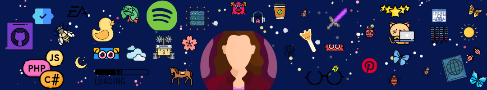

<!--- Olá, esse é meu readme, fique à vontade para utilizá-lo como quiser! -->

-----

-----
# 👋 Hello! Welcome to my Github profile.
## My name is Maria Clara and my nickname is "Maria"!

Seja bem-vindo ao meu perfil! 👋 Sou uma estudante apaixonada pelo mundo da Engenharia de Software na PUC Minas, buscando constantemente aprender e contribuir para a comunidade de desenvolvimento. Abaixo, compartilho um pouco sobre mim e meu percurso acadêmico.

## Sobre Mim

- 👨‍🎓 **Graduanda**: Engenharia de Software na PUC Minas.
- 🌱 **Atividades Atuais**: Foco em aprimorar meus conhecimentos em desenvolvimento de software, design de sistemas e metodologias ágeis.

## Habilidades

- **Linguagens de Programação:** C, Phyton
- **Desenvolvimento Web:** HTML, CSS, JavaScript, React
- **Banco de Dados:** MySQL, MongoDB
- **Metodologias:** Scrum, Kanban
- **Ferramentas:** Git, VS Code, Eclipse, Replit

## Ouvindo Spotify

## Ferramentas e Tecnologias

       
          

## Contatos:

   

  

## Estatísticas

<a href="https://github.com/mariaoliveira27">

